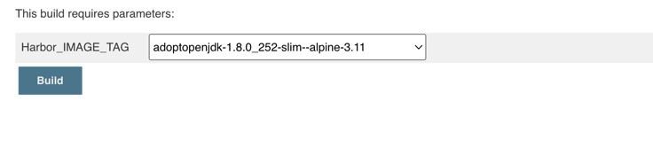
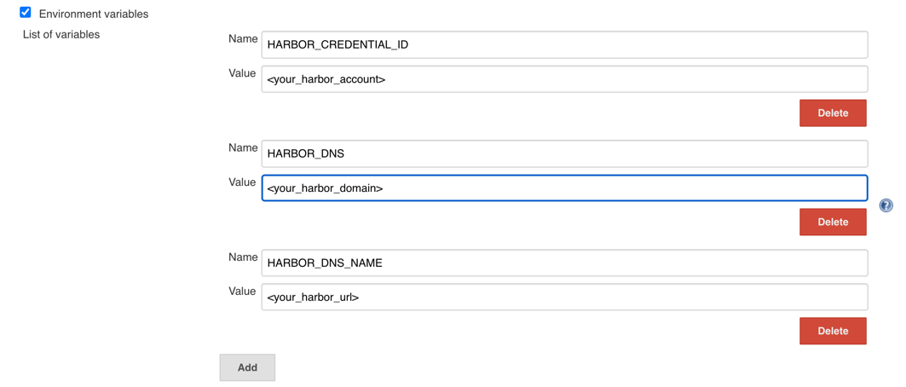
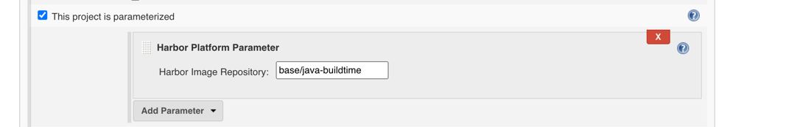

# Harbor Platform Plugin
[](https://bintray.com/geyifeng/maven/immersionbar) 

### [README of Chinese](./README_CN.md)

## About
A plugin for integrating Harbor Docker Image Manager into a Jenkins job. The Harbor-Platform-Plugin provides fundamental Docker operations for Jenkins job. It can pull, push and list the Docker images.

## Effect Picture


## Download the demo
#### [Click me to Download the demo](./example/harbor-platform-plugin.hpi)

## Release notes
### 1.0.0
- Get image information from Harbor。
- Put result data into environment。

## Documentation

- ①  Create three environment variables in jenkins configure.


- ② Add this plugin into your jenkins job and add a repository name which your need.


- ③ Get result data from jenins environment.
   ```
    echo "$IMAGE"
    echo "$IMAGE_TAG"
   ```
## Description of various difficult problems and their solutions
   ```
   Latest Jenkins version 2.289.2
      

   ```
## Special instructions
   ```
   Dependency software with MIT License.
   
      <dependency>
          <groupId>org.jenkins-ci.plugins</groupId>
          <artifactId>jquery</artifactId>
          <version>1.11.2-0</version>
      </dependency>
      
      <dependency>
          <groupId>org.jenkins-ci.plugins</groupId>
          <artifactId>credentials</artifactId>
          <version>2.1.16</version>
      </dependency>
      
      <dependency>
          <groupId>org.slf4j</groupId>
          <artifactId>slf4j-api</artifactId>
          <version>1.7.26</version>
      </dependency>
      
      <dependency>
          <groupId>org.slf4j</groupId>
          <artifactId>slf4j-jdk14</artifactId>
          <version>1.7.26</version>
          <scope>test</scope>
      </dependency>
      
      <dependency>
          <groupId>org.slf4j</groupId>
          <artifactId>jcl-over-slf4j</artifactId>
          <version>1.7.26</version>
      </dependency>
      
      Font Awesome CSS, LESS, and SASS
      Foundation Icons
      Bootstrap
      Glyph Icons
      jquery ui
    
    Dependency software with Apache 2.0 License.
   
      <dependency>
          <groupId>com.fasterxml.jackson.core</groupId>
          <artifactId>jackson-core</artifactId>
          <version>2.10.0</version>
      </dependency>

      <dependency>
          <groupId>org.apache.httpcomponents</groupId>
          <artifactId>httpclient</artifactId>
          <version>4.5.10</version>
      </dependency>

      <dependency>
          <groupId>com.alibaba</groupId>
          <artifactId>fastjson</artifactId>
          <version>1.2.62</version>
      </dependency>

      <dependency>
          <groupId>org.slf4j</groupId>
          <artifactId>log4j-over-slf4j</artifactId>
          <version>1.7.26</version>
      </dependency>
      
      selectize.bootstrap2.css
      selectize.css
   ```