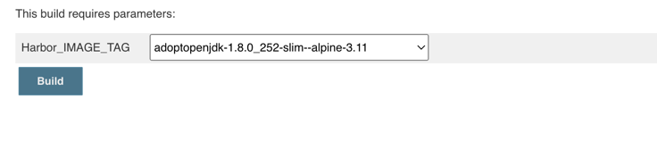
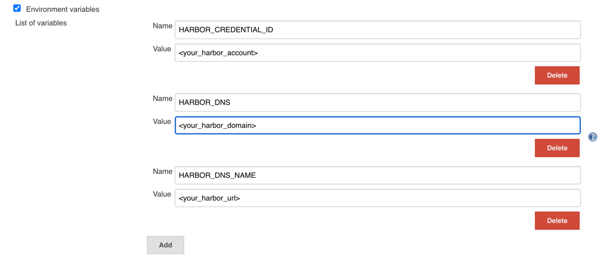
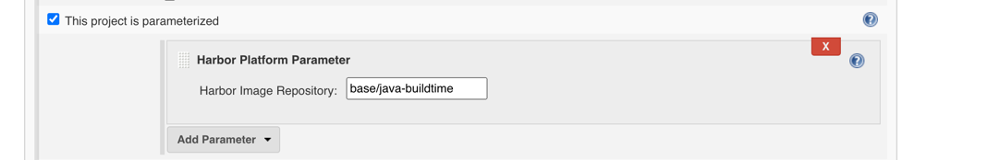

# Harbor Platform Plugin
[](https://bintray.com/geyifeng/maven/immersionbar) 

## 项目介绍
Jenkins集成harbor插件进行docker image管理，提供用户拉取、展示和上传镜像。

## 效果图


## 下载demo
#### [点我下载demo](./example/harbor-platform-plugin.hpi)

## 版本说明
### 1.0.0 
- 添加harbor镜像地址解析功能。
- 环境变量返回解析结果功能。

## 技术文档
### 基本用法

- ①  在Jenkins配置中添加键值对参数：HARBOR_CREDENTIAL_ID、HARBOR_DNS、HARBOR_DNS_NAME.


- ② 在插件的配置中填入需要操作的harbor repository地址。


- ③ 从环境变量中可读取插件返回的结果.
   ```
    echo "$IMAGE"
    echo "$IMAGE_TAG"
   ```
## 各种疑难问题的描述，及其解决方案
   ```
   Jenkins版本建议大于2.289.2
      

   ```
## 特别说明
   ```
   使用依赖库，遵循MIT协议。
   
      <dependency>
          <groupId>org.jenkins-ci.plugins</groupId>
          <artifactId>jquery</artifactId>
          <version>1.11.2-0</version>
      </dependency>
      
      <dependency>
          <groupId>org.jenkins-ci.plugins</groupId>
          <artifactId>credentials</artifactId>
          <version>2.1.16</version>
      </dependency>
      
      <dependency>
          <groupId>org.slf4j</groupId>
          <artifactId>slf4j-api</artifactId>
          <version>1.7.26</version>
      </dependency>
      
      <dependency>
          <groupId>org.slf4j</groupId>
          <artifactId>slf4j-jdk14</artifactId>
          <version>1.7.26</version>
          <scope>test</scope>
      </dependency>
      
      <dependency>
          <groupId>org.slf4j</groupId>
          <artifactId>jcl-over-slf4j</artifactId>
          <version>1.7.26</version>
      </dependency>
      
      Font Awesome CSS, LESS, and SASS
      Foundation Icons
      Bootstrap
      Glyph Icons
      jquery ui
    
    使用依赖库，遵循Apache 2.0协议。
   
      <dependency>
          <groupId>com.fasterxml.jackson.core</groupId>
          <artifactId>jackson-core</artifactId>
          <version>2.10.0</version>
      </dependency>

      <dependency>
          <groupId>org.apache.httpcomponents</groupId>
          <artifactId>httpclient</artifactId>
          <version>4.5.10</version>
      </dependency>

      <dependency>
          <groupId>com.alibaba</groupId>
          <artifactId>fastjson</artifactId>
          <version>1.2.62</version>
      </dependency>

      <dependency>
          <groupId>org.slf4j</groupId>
          <artifactId>log4j-over-slf4j</artifactId>
          <version>1.7.26</version>
      </dependency>
      
      selectize.bootstrap2.css
      selectize.css
   ```

## 联系我
- hcc_app@homectedit.cn